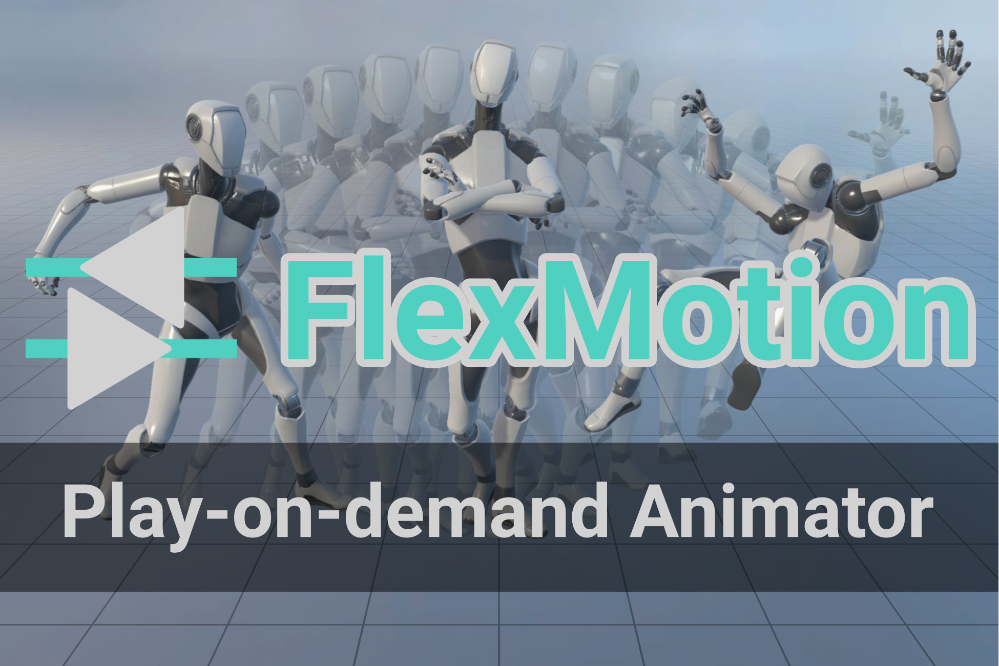

Title: Index
NoSidebar: true
NoRightSidebar: true
xref: bootstrapper
---
```raw
@section Title { }
```



<div class="text-center mb-4">

#### **An easy-to-use play-on-demand animator for Unity by [Mathieu Philippe](https://www.moartis.dev).**
#### **Take back control over your animations with FlexMotion**!

When I was working on a game prototype featuring different types of ranged and melee weapons, I grew tired of fighting with an ever-growing and overly complex [animator controller](https://docs.unity3d.com/Manual/class-AnimatorController.html). While Mecanim is great for the use-cases it was designed for, I needed to be able to easily transition from one animation set to another through scripting.

Thus I started to develop my own animation system using Unity's [Playables](https://docs.unity3d.com/ScriptReference/Playables.Playable.html). After many months of using and polishing it, I decided to release FlexMotion as my first commercial tool.

#### **Available right now on the [Unity Asset Store](https://u3d.as/3aq5)**!

</div>

# Key features

<?! KeyFeatures /?>

# Showcase

```raw
</br>
```

Check out the **[WebGL showcase build](showcase)** to test these features yourself.

<?# Figure Src="/img/showcase.jpg" Class="text-center" Link="showcase" /?>

```raw
</br>
```
